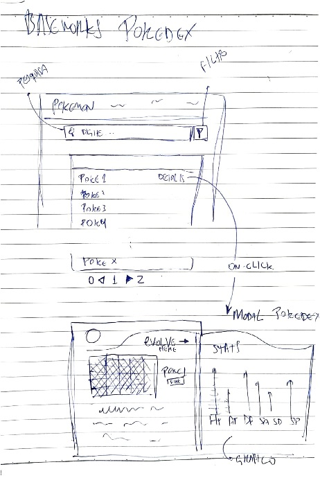

# Baseworks + Pokédex - Pedro Presotto

**Link da aplicação em funcionamento (Vercel)**: https://pokedex-baseworks-pedro-presotto.vercel.app/

## Visão Geral

Esta é a minha implementação de uma **Pokédex** utilizando Vue.js 3, resultado de um desafio de uma semana proposto pela **Baseworks** para vaga de dev front-end. A aplicação permite ao usuário pesquisar, visualizar, favoritar e filtrar informações sobre Pokémons por meio da PokeAPI. A interface foi desenvolvida com foco na usabilidade, garantindo uma experiência intuitiva e eficaz tanto em dispositivos móveis quanto em desktops.

O projeto foi elaborado seguindo boas práticas de programação, visando facilitar futuras manutenções/incrementos futuros e evitar retrabalho. Entre os conceitos aplicados, destacam-se: clean code, componentes reutilizáveis, Sass, comentários e GraphQL para fazer o minimo de requisições possível.

## Instalação e Execução

- Para executar o sistema web localmente, baixe/clone o repositório e acesse o diretório `.frontend/`
- Execute o comando `npm install` para o download de todos os pacotes utilizados no projeto
- Por fim execute o comando npm run dev para executar o projeto na porta `http://localhost:5173/` no navegador de sua preferência

## Sketch do Projeto e Referência visual inicial

### Funcionalidades Requeridas Implementadas (Todas)

1. **Listagem de Pokémon**:

   - Tabela paginada com imagens, nomes e números dos Pokémon.
   - Paginação clássica para navegação.

2. **Detalhes do Pokémon**:

   - Modal com informações detalhadas (estatísticas, tipos e evoluções).

3. **Busca e Filtro**:

   - Barra de busca por nome ou número.
   - Filtro por tipo (água, fogo, grama, etc.).

4. **Responsividade e Desempenho**:
   - Aplicação responsiva e otimizada para diversos dispositivos.

### Funcionalidades Extras Implementadas

- **Favoritos**:
  - Usuários podem marcar Pokémon como favoritos e acessá-los em uma seção dedicada.

## Tecnologias Utilizadas

- **Vue.js 3**
- **TypeScript**
- **Vite**
- **Requisições GraphQL**
- **Bootstrap**
- **Sass**
